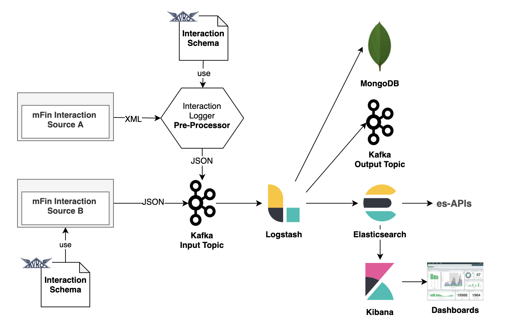
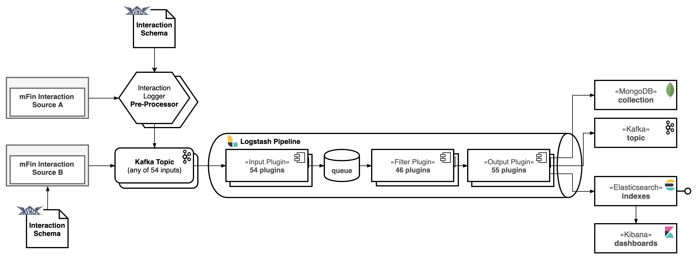
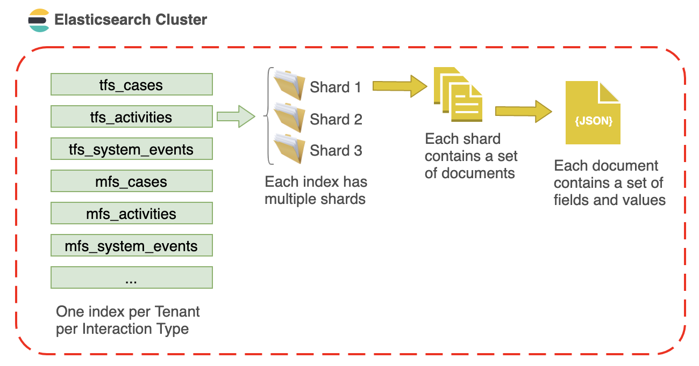
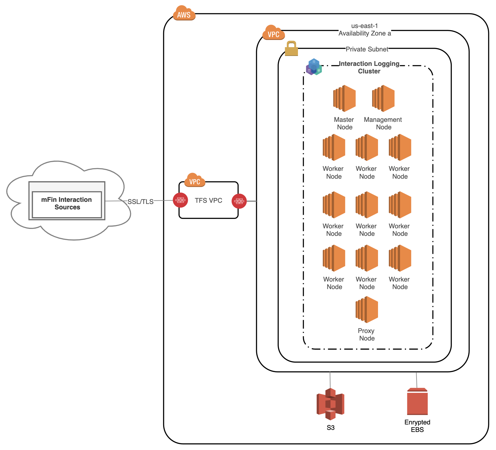

### Table of Contents

[<b>1 Design Goals</b>](#1-design-goals)

[<b>2 Interaction Schema</b>](#2-interaction-schema)

[<b>3 Interaction Logging Framework High Level Design</b>](#3-interaction-logging-framework-high-level-design)

[<b>4 Interaction Logging Framework Detail Design</b>](#4-interaction-logging-framework-detail-design)

&nbsp;&nbsp;&nbsp;&nbsp;[4.1 Elastic Stack Detail Design](#41-elastic-stack-detail-design)

&nbsp;&nbsp;&nbsp;&nbsp;[4.2 mFin Data Layout](#42-mfin-data-layout)

[<b>5 Deployment of Interaction Logging Framework</b>](#5-deployment-of-interaction-logging-framework)

&nbsp;&nbsp;&nbsp;&nbsp;[5.1 Deployment Topology](#51-deployment-topology)

&nbsp;&nbsp;&nbsp;&nbsp;[5.2 Infrastructure Architecture](#52-infrastructure-architecture)

&nbsp;&nbsp;&nbsp;&nbsp;[5.3 mFin Capacity Planning](#53-mfin-capacity-planning)

[<b>Refrences</b>](#references)

 

### 1 Design Goals
TFS needs ability to reliably and securely collects data related to Cases, Activities and System Events from all Tenants and Channels as well as ability to search, analyze, and visualize that data  in real-time. In what follows we will refer to the Cases, Activities and System Events as Interactions and related data as Interaction Data.

### 2 Interaction Schema
A sample of Activities and Cases data is presented in the activities-cases folder. We use the sample Data to define the Interaction Schema in Avro format – see <code>interactions.avsc</code> in the <code>schemas</code> folder.

### 3 Interaction Logging Framework High Level Design
The Interactions Logging Framework proposed in this document is based on the Elastic Stack as shown in Figure 1:

*Figure 1: Interaction Logging Framework - High Level Design*

### 4 Interaction Logging Framework Detail Design
This section introduces design details of the Interaction Logging Framework including:
* Elastic Stack detail design,
* mFin data layout.

#### 4.1 Elastic Stack Detail Design
Figure 2 depicts the detail design of the Interaction Logging Framework Elastic Stack components.

*Figure 2: Interaction Logging Framework*

The following initial design decisions will be validated and modified if needed during the implementation phase:
* The design supports receiving Schema compliant Interactions directly from Interaction Sources, 
* To support Sources that cannot provide Schema compliant Interactions, the design supports Pre-Processing of those Interactions,
* The design supports receiving Interactions via any of the Logstash’s 54 Input Plugins (see Reference [2]) – the initial deployment will utilize Kafka plugin,
* The design supports logging Interactions on single or multiple Kafka Topics (see <code>interactions.avsc</code> in the <code>schemas</code> folder) – the initial deployment will utilize single Kafka Topic for processing all Interactions,
* The design supports in-memory bounded queues between pipeline stages (inputs -> pipeline workers, see Reference [3]) to provide durability of data within Logstash – the initial deployment will have this configuration set to <code>True</code>,
* We will use Logstash Filter Plugins (46 Plugins is available,  see Reference [4]) to generate one Elasticsearch Index per Tenant and Interaction Type,
* The design supports delivery of indexed data via any of the Logstash’s 55 Output Plugins (see Reference [5]) – the initial deployment will utilize Elasticsearch, Kafka and MongoDB.

Prior to the deployment into production we will perform load test that includes 5 years of Interaction data.

#### 4.2 mFin Data Layout

To segregate Tenants’ information persisted in Elasticsearch, we define one index per Tenant per Interaction Type  as shown in Figure 3:

*Figure 3: Interaction Logging Framework*

### 5 Deployment of Interaction Logging Framework

This section introduces deployment details of the Interaction Logging Framework including:
* Deployment topology,
* Infrastructure architecture.

#### 5.1 Deployment Topology

Two separate Elastic Stack  environments: Sandbox  and Production are deployed in two separate clusters – Figure 4 depicts one cluster. 

*Figure 4: Interaction Logging Framework Deployment Topology*

The Sandbox environment is used by developers for extensive testing of configurations prior to deploying them in production. Each environment has separate instance of Kibana for visualization and management of Elasticsearch data.

The TFS Logging Framework captures log data from multiple tenants. Tenants are able to query and report on their log data in near real time. To segregate tenants’ information persisted in Elasticsearch, we define one index per Tenant. 

#### 5.2 Infrastructure Architecture

Figure 5 shows the Interaction Logging Framework infrastructure architecture:

*Figure 5: Interaction Logging Framework – Infrastructure Architecture*

The nine-node sandbox environment shown above is deployed in one Availability Zone and can be scaled up to a production cluster distributed over three Availability Zones with three worker nodes in each.

The environment consists of the following technology components:
* Kibana – three nodes,
* Logstash – three nodes,
* Elasticsearch Ingest/Client – three nodes,
* Elasticsearch Master – three nodes,
* Elasticsearch Data – three nodes,
* Kafka – four nodes.

The following Kubernetes resource types are used for deployment of the above technology components: 
* Deployment for Kibana nodes (stateless),
* StatefulSet for Logstash nodes (stateful),
* Deployment for Elasticsearch Master nodes (stateless),
* Deployment for Elasticsearch Ingest/Client nodes (stateless),
* StatefulSet for Elasticsearch Data nodes (stateful),
* StatefulSet for Kafka nodes (stateful).

To avoid an outage due to the loss of that individual machine, we need to preclude co-locating multiple instances of the resources on the same machine by deploying them in anti-affinity mode. 

To secure the Interaction Logging Cluster, all connections are encrypted using Transport Layer Security (TLS) and AWS EBS storage is encrypted. 

#### 5.3 mFin Capacity Planning

Determining the number of shards needed is not straight forward. The result depends on many variables: the hardware used, the size and complexity of document, how are document indexed and searched, and more.

Therefore, we propose performing a single shard capacity test. Essentially, we want to replicate real-world usage and to push this single shard until it “breaks,” i.e., until the response time exceeds acceptable level. 

Once we  define the capacity of a single shard, it is easy to extrapolate the number of shards needed to process the whole index. Take the total amount of data that we need to index, plus some extra for future growth, and divide by the capacity of a single shard. The result is the number of primary shards that we  will need.

### References:

[1]	Elastic Stack: https://www.elastic.co/products/elastic-stack 

[2] Logstash Input Plugins: https://www.elastic.co/guide/en/logstash/current/input-plugins.html

[3] Logstash Persistent Queues: https://www.elastic.co/guide/en/logstash/current/persistent-queues.html

[4] Logstash Filter Plugins: https://www.elastic.co/guide/en/logstash/current/filter-plugins.html

[5] Logstash Output Plugins: https://www.elastic.co/guide/en/logstash/current/output-plugins.html

